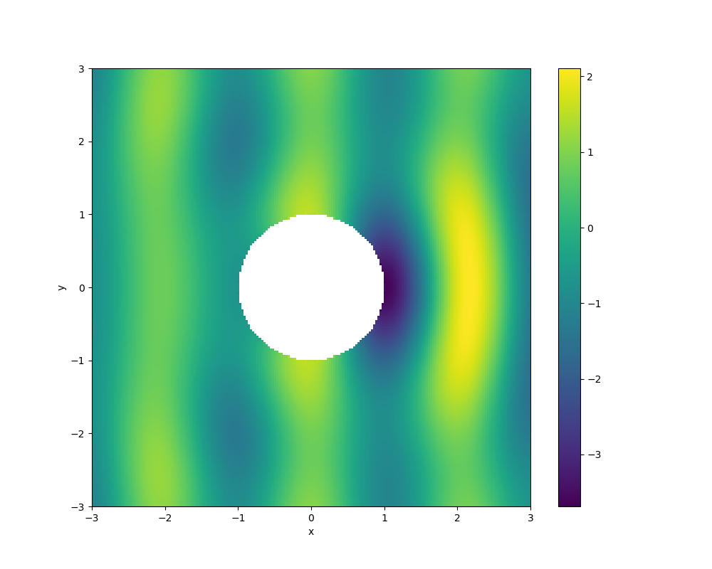

# Summary

The boundary element method (BEM) is a numerical method for approximating the solution of partial differential equations.

``Bempp-cl`` is...

Assembly of all the standard integral kernels for Laplace, Helmholtz, modified Helmholtz, and electromagnetic problems.

A comprehensive operator algebra that makes it easy to formulate complex product operator formulations.

# OpenCL

``Bempp-cl`` uses PyOpenCL [@pyopencl] to perform just-in-time compilation of its computational kernels.
The use us OpenCL allows us to parallelise our code on a wide range of CPU and GPU devices while
only maintaining a single code path.

TODO: Say more here

(cite old bempp paper?) There are two versions of Bempp available, a legacy version, which is Bempp 3.3.4, and a new development version Bempp-cl 0.1.0. The latter version is essentially feature 
complete for the dense assembly of operators, provides advanced support for AVX2 and AVX-512 instruction sets, and supports GPUs. The advantage of the legacy version is the mature H-Matrix arithmetic 
that allows the solution of very large problems. Currently, Bempp-cl only supports the dense assembly of operators and is therefore restricted to problems in the dimension of a few ten thousand (or 
around 100,000 using a specific dense evaluator mode on GPUs). Support for large-scale problems is one of the main working areas for Bempp-cl. This handbook focuses completely on Bempp-cl.

# Example

As an example, we solve a Helmholtz scattering problem. Let $\Omega^-=\{(x,y,z):x^2+y^2+z^2\leqslant1\}$ be a unit sphere,
let $\Gamma=\{(x,y,z):x^2+y^2+z^2=1\}$ be the boundary of the sphere and let \(\Omega^+=\mathbb{R}^3\setminus\Omega^-$ be the domain exterior to the sphere.
We want to solve
\begin{align*}
\Delta u^\text{tot} + k^2u^\text{tot} &=0&&\text{in }\Omega^+,\\
u^\text{s}&=-u^\text{inc}&&\text{on }\Gamma,\\
\frac{\partial u^\text{s}}{\partial\left|(x,y,z)\right|}-\mathrm{i} ku^\text{s}&=o(\left|(x,y,z)\right|^{-1})&&\text{as }\left|(x,y,z)\right|\to\infty,
\end{align*}
where $u^\text{inc}$ is the incident wave, $u^\text{s}$ is the scattered wave, $u^\text{tot}=u^\text{inc}+u^{s}$ is the total wave, and $k$ is the wavenumber of the problem.
In this example, we take $k=3$ and $u^\text{inc}(x,y,z)=\mathrm{e}^{\mathrm{i}kx}$.

The standard boundary integral formulation [@coltonkress] of this problem is: Find $\lambda\in H^{-1/2}(\Gamma)$ such that
\begin{align*}
\left\langle\mathsf{V}\lambda,\mu\right\rangle_\Gamma&=\left\langle(\mathsf{K}-\tfrac12\mathsf{Id})u^\text{inc},\mu\right\rangle_\Gamma
&&\forall\mu\in H^{-1/2}(\Gamma),
\end{align*}
where $\mathsf{V}$ is the single layer boundary operator, $\mathsf{K}$ is the double layer boundary operator, and $\mathsf{Id}$ is the identity operator. Once $\lambda$ has been found,
the solution can be computed at points inside $\Omega^+$ using the representation formula
$$u^\text{s}=-\mathcal{K}u^\text{inc}-\mathcal{V}\lambda,$$
where $\mathcal{V}$ is the single layer potential operator and $\mathcal{K}$ is the double layer potential operator.

To solve this problem using Bempp-cl, we start by importing the necessary modules.
```python
import bempp.api
import numpy as np
from bempp.api.operators.boundary import sparse, helmholtz
from bempp.api.operators.potential import helmholtz as helmholtz_pot
from matplotlib import pyplot as plt
```

We then define the wavenumber, $k$, the discretisation of the sphere, and the discrete function space. Here, we use the space DP0 of piecewise constant functions.
```python
k = 3

grid = bempp.api.shapes.sphere(h=0.1)
space = bempp.api.function_space(grid, "DP", 0)
```
Next, we define the identity, single layer and double layer boundary operators, and use them to calculate the right hand side term $\left\langle(\mathsf{K}-\tfrac12\mathsf{Id})u^\text{inc},\mu\right\rangle_\Gamma$.
```python
ident = sparse.identity(space, space, space)
dlp = helmholtz.double_layer(space, space, space, k)
slp = helmholtz.single_layer(space, space, space, k)


@bempp.api.complex_callable
def u_inc(x, n, domain_index, result):
    result[0] = np.exp(1j * k * x[0])


u_inc = bempp.api.GridFunction(space, fun=u_inc)
rhs = (dlp - 0.5 * ident) * u_inc
```

Next we use the GMRES iterative solver to find the solution of the equation
$\left\langle(\mathsf{K}-\tfrac12\mathsf{Id})u^\text{inc},\mu\right\rangle_\Gamma$.
The function `bempp.api.linalg.gmres` is a wrapper around the SciPy [@scipy] GMRES solver.
```python
l, info = bempp.api.linalg.gmres(slp, rhs)
```

Finally, we define a grid of points and use the representation formula,
$u^\text{s}=-\mathcal{K}u^\text{inc}-\mathcal{V}\lambda,$ to calculate the solution the points in this grid that are outside the sphere.
```python
Nx = 200
Ny = 200
xmin, xmax, ymin, ymax = [-3, 3, -3, 3]
plot_grid = np.mgrid[xmin:xmax:Nx * 1j, ymin:ymax:Ny * 1j]
points = np.vstack((plot_grid[0].ravel(),
                    plot_grid[1].ravel(),
                    np.zeros(plot_grid[0].size)))
u_evaluated = np.zeros(points.shape[1], dtype=np.complex128)
u_evaluated[:] = np.nan

x, y, z = points
idx = np.sqrt(x**2 + y**2) > 1.0

slp_pot = helmholtz_pot.single_layer(space, points[:, idx], k)
dlp_pot = helmholtz_pot.double_layer(space, points[:, idx], k)
res = np.real(np.exp(1j * k * points[0, idx])
              - dlp_pot.evaluate(u_inc) - slp_pot.evaluate(l))
u_evaluated[idx] = res.flat
u_evaluated = u_evaluated.reshape((Nx, Ny))

fig = plt.figure(figsize=(10, 8))
plt.imshow(np.real(u_evaluated.T), extent=[-3, 3, -3, 3])
plt.xlabel('x')
plt.ylabel('y')
plt.colorbar()
plt.savefig("solution.png")
```

The plot obtained by this code is shown below. 


# Mathematics

Single dollars (\$) are required for inline mathematics e.g. $f(x) = e^{\pi/x}$

Double dollars make self-standing equations:

$$\Theta(x) = \left\{\begin{array}{l}
0\textrm{ if } x < 0\cr
1\textrm{ else}
\end{array}\right.$$


# Citations

Citations to entries in paper.bib should be in
[rMarkdown](http://rmarkdown.rstudio.com/authoring_bibliographies_and_citations.html)
format.

For a quick reference, the following citation commands can be used:
- `@author:2001`  ->  "Author et al. (2001)"
- `[@author:2001]` -> "(Author et al., 2001)"
- `[@author1:2001; @author2:2001]` -> "(Author1 et al., 2001; Author2 et al., 2002)"

# Figures

% Figures can be included like this: 

# Acknowledgements

We acknowledge contributions from Brigitta Sipocz, Syrtis Major, and Semyeong
Oh, and support from Kathryn Johnston during the genesis of this project.

# References
