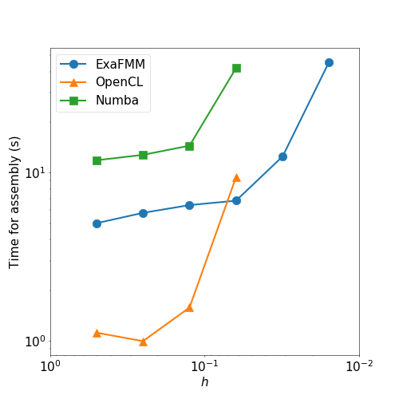
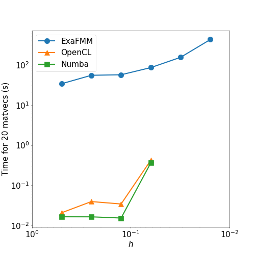

# Summary

The boundary element method (BEM) is a numerical method for approximating the solution of partial differential equations (PDEs).
The method finds the approximation by discretising a boundary integral equation that can be derived from the PDE. The mathematical
background of BEM is covered in, for example, @Stein07 or @McLean.

Bempp-cl is an open-source boundary element method library that can be used to assemble all the standard integral kernels for
Laplace, Helmholtz, modified Helmholtz, and Maxwell problems. The library has a user-friendly Python interface that allows the
user to use BEM to solve a variety of problems, including problems in electrostatics, acoustics and electromagnetics.

Bempp-cl began life as BEM++, and was a Python library with a C++ computational core. The ++ slowly transitioned into pp as
functionality gradually moved from C++ to Python with only a few core routines remaining in C++. Bempp-cl is the culmination of efforts to
fully move to Python. It is an almost complete rewrite of Bempp. The C++ core has been completely replaced by highly SIMD optimised just-in-time compiled OpenCL kernels, or alternatively, by just-in-time compiled Numba routines, which are automatically used on systems that do not provide OpenCL drivers.

In this paper, we give an overview of the functionality of Bempp-cl and present highlights of the library's recent developments.
An overview of the original version of the library is presented in @bemppold. Full documentation of the library can be found
online at ``bempp.com`` and in @bempphandbook.

# An overview of Bempp features
Bempp-cl is divided into two parts: `bempp.api` and `bempp.core`.
The user interface of the library is contained in `bempp.api`.
The core assembly routines of the library are contained in `bempp.core`. The majority of users of Bempp are unlikely to need
to directly interact with the functionality in `bempp.core`.

There are five main steps that are commonly taken when solving a problem with BEM.
First a grid (or mesh) must be created on which to solve the problem.
Then finite dimensional function spaces are defined on this grid.
These function spaces are then used to discretise the boundary operators of the formulation of problem being solved,
and appropriate right-hand-side data is computed in a space.
A linear solver is then use to solve the discrete problem on the boundary.
Finally, potential operators can be used to evaluate the solution at points in the domain.

The submodule `bempp.api.shapes` contains the definitions of a number of shapes. From these, grids with various element
sizes can be created internally using Gmsh [@gmsh]. Alternatively, meshes can be imported from many formats using the
meshio library [@meshio]. Bempp-cl currently only supports flat triangle based surface meshes. Higher-order triangular meshes may be supported
in the future.

Bempp-cl provides piecewise constant and piecewise linear (continuous and discontinuous) function spaces for solving scalar problems.
For Maxwell problems, Bempp can create Rao--Wilson--Glisson [@rwg] (or Raviart--Thomas [@rt]) div-conforming spaces and
N\'ed\'elec [@nedelec] curl-conforming spaces. In addition to these, Bempp can also generate constant and linear spaces on the
barycentric dual grid as well as Buffa--Christiansen div-conforming spaces, as described in @bc. These spaces can all be
created using the `bempp.api.function_space` command.

Boundary operators for Laplace, Helmholtz, modified Helmholtz and Maxwell problems can be found in the `bempp.api.operators.boundary`
submodule, as well as sparse identity operators. For Laplace and Helmholtz problems, Bempp can create single layer, double layer,
adjoint double layer and hypersingular operators. For Maxwell problems, both electric field and magnetic field operators can be used.
For formulations involving the product of operators, such at Calder\'on preconditioned Maxwell problems [@maxwellbempp], Bempp
contains an operator algebra that allows the product to be easily obtained. This operator algebra is described in detail in @operatoralg.

The submodule `bempp.api.linalg` contains wrapped versions of SciPy's [@scipy] LU, CG, and GMRes solvers. By using SciPy's `LinearOperator`
interface, Bempp's boundary operators can easily be used with other iterative solvers.

Potential operators for the evaluation at points in the domain are included in the `bempp.api.operators.potential` submodule.

# Assembly in Bempp
The most performance-critical parts of the library are the assembly of boundary operators, and the use of assembled operators to calculate matrix-vector
products. In this section, we look at how operators are handled internally in Bempp.

## OpenCL based assembly
The Bempp core contains OpenCL kernels for the assembly of boundary and potential operators. These are just-in-time compiled when needed by
PyOpenCL [@pyopencl]. Each OpenCL kernel exists in a non-vectorized variant that can be executed on GPUs, and vectorized kernels for SIMD CPUs. Here, we support vector widths of 4, 8 or 16 parallel operations. While the user can choose the type of kernel to run, typically this is automatically detected at runtime without user intervention necessary. Through compiler pragmas each kernel can be compiled either in single or in double precision arithmetic.
The use of OpenCL allows Bempp to seemlessly parallelise the computation of operators on a wide range of CPU and GPU devices.
Dense assembly using OpenCL is Bempp's default behaviour. We stress that while dense assembly of operators is possible on GPUs, memory requirements and GPU memory transfer limitations mean that for normal applications Bempp should be run on CPUs.

## Numba
On systems without OpenCL support, or with limited OpenCL support such as recent versions of MacOS, Bempp can alternatively use Numba [@numba]
to just-in-time compile Python-based assembly kernels. The performance of these kernels is lower than the OpenCL kernels as they rely on autovectorisation for SIMD, which gives lower performance than the hand-tuned low-level OpenCL kernels. But they provide a viable alternative when OpenCL is unavailable. Indeed, sparse mass matrices are always assembled using Numba as this operation is less performance critical on boundary element surface meshes.

If Bempp-cl cannot locate OpenCL support, it will use Numba assembly by default. When OpenCL is available, Numba assembly can be used by
passing the option `device_interface="numba"` when initialising an operator.

## The Fast Multiple Method
The OpenCL and Numba assembly routines both create dense matrices. For problem sizes up to twenty or thirty thousand elements this is fine (depending on available memory), but the quadratic memory and computational complexity of dense assembly means that this mode does not scale to large problems. A solution is the Fast Multipole Method (FMM). It allows the approximate evaluation of matrix-vector products with boundary operators in linear memory and computational complexity without requiring to store the actual matrices. Bempp provides a black-box interface to FMM libraries and can interface any FMM code that returns potentials and gradients of potentials. Bempp then applies sparse pre- and post-transformations that translate between Galerkin integrals and potential evaluation on quadrature points. Currently, we provide a concrete FMM interface to the ExaFMM library [@exafmm], a stable and highly performant C++ based FMM implementations for Laplace and low-frequency Helmholtz kernels. The use of FMM can be enabled for operator assemby by passing the option `assembly="fmm".`

A performance comparison of assembly and matrix-vector product computation using OpenCL, Numba, and ExaFMM is shown below.
It can be seen that as $h$ is reduced, the timings for OpenCL and Numba start to increase sharply,
while those for ExaFMM remain steady. The results for ExaFMM continue to lower values of $h$: for
these meshes both the OpenCL and Numba assemblers ran out of memory to store their dense matrices.
For smaller problems, however, it makes sense to use a dense assembler, as the initial cost of
setting up the FMM data structures is high.




# A wave scattering example
In this section, we present an example use of Bempp-cl to solve a Helmholtz scattering problem.
Let $\Omega^-=\{(x,y,z):x^2+y^2+z^2\leqslant1\}$ be a unit sphere,
let $\Gamma=\{(x,y,z):x^2+y^2+z^2=1\}$ be the boundary of the sphere and let \(\Omega^+=\mathbb{R}^3\setminus\Omega^-$ be the
domain exterior to the sphere.
We want to solve
\begin{align*}
\Delta u^\text{tot} + k^2u^\text{tot} &=0&&\text{in }\Omega^+,\\
u^\text{s}&=-u^\text{inc}&&\text{on }\Gamma,\\
\frac{\partial u^\text{s}}{\partial\left|(x,y,z)\right|}-\mathrm{i} ku^\text{s}&=o(\left|(x,y,z)\right|^{-1})
&&\text{as }\left|(x,y,z)\right|\to\infty,
\end{align*}
where $u^\text{inc}$ is the incident wave, $u^\text{s}$ is the scattered wave, $u^\text{tot}=u^\text{inc}+u^{s}$ is the total
wave, and $k$ is the wavenumber of the problem.
In this example, we take $k=3$ and $u^\text{inc}(x,y,z)=\mathrm{e}^{\mathrm{i}kx}$.

The single layer boundary integral formulation [@ColtonKress] of this problem is: Find $\lambda\in H^{-1/2}(\Gamma)$ such that
\begin{align*}
\left\langle\mathsf{V}\lambda,\mu\right\rangle_\Gamma
&=\left\langle(\mathsf{K}-\tfrac12\mathsf{Id})u^\text{inc},\mu\right\rangle_\Gamma
&&\forall\mu\in H^{-1/2}(\Gamma),
\end{align*}
where $\mathsf{V}$ is the single layer boundary operator, $\mathsf{K}$ is the double layer boundary operator, and $\mathsf{Id}$
is the identity operator. Once $\lambda$ has been found,
the solution can be computed at points inside $\Omega^+$ using the representation formula
$$u^\text{s}=-\mathcal{K}u^\text{inc}-\mathcal{V}\lambda,$$
where $\mathcal{V}$ is the single layer potential operator and $\mathcal{K}$ is the double layer potential operator.

To solve this problem using Bempp-cl, we start by importing the necessary modules.
```python
import bempp.api
import numpy as np
from bempp.api.operators.boundary import sparse, helmholtz
from bempp.api.operators.potential import helmholtz as helmholtz_pot
from matplotlib import pyplot as plt
```

We then define the wavenumber, $k$, the discretisation of the sphere, and the discrete function space. Here, we use the space
DP0 of piecewise constant functions.
```python
k = 3

grid = bempp.api.shapes.sphere(h=0.1)
space = bempp.api.function_space(grid, "DP", 0)
```

Next, we define the identity, single layer and double layer boundary operators, and use them to calculate the right hand side
term $\left\langle(\mathsf{K}-\tfrac12\mathsf{Id})u^\text{inc},\mu\right\rangle_\Gamma$. The library is designed so that
implemention closely resembles the mathematical formulation; this is evident in the final line, where the definition of 
`rhs` is the implementation of the term $(\mathsf{K}-\tfrac12\mathsf{Id})u^\text{inc}$.

In this example, we use ExaFMM for the assembly of the operators.
```python
ident = sparse.identity(space, space, space)
dlp = helmholtz.double_layer(space, space, space, k, assembler="fmm")
slp = helmholtz.single_layer(space, space, space, k, assembler="fmm")


@bempp.api.complex_callable
def u_inc(x, n, domain_index, result):
    result[0] = np.exp(1j * k * x[0])


u_inc = bempp.api.GridFunction(space, fun=u_inc)
rhs = (dlp - 0.5 * ident) * u_inc
```

Next we use the GMRES iterative solver to find the solution of the equation
$\left\langle\mathsf{V}\lambda,\mu\right\rangle_\Gamma=\left\langle(\mathsf{K}-\tfrac12\mathsf{Id})u^\text{inc},\mu\right\rangle_\Gamma$.
The function `bempp.api.linalg.gmres` is a wrapper around the GMRES solver from SciPy [@scipy].
```python
solution, info = bempp.api.linalg.gmres(slp, rhs)
```

Finally, we define a grid of points and use the representation formula,
$u^\text{s}=-\mathcal{K}u^\text{inc}-\mathcal{V}\lambda,$ to calculate the solution the points in this grid that are outside
the sphere.
```python
Nx = 200
Ny = 200
xmin, xmax, ymin, ymax = [-3, 3, -3, 3]
plot_grid = np.mgrid[xmin:xmax:Nx * 1j, ymin:ymax:Ny * 1j]
points = np.vstack((plot_grid[0].ravel(),
                    plot_grid[1].ravel(),
                    np.zeros(plot_grid[0].size)))
u_evaluated = np.zeros(points.shape[1], dtype=np.complex128)
u_evaluated[:] = np.nan

x, y, z = points
idx = np.sqrt(x**2 + y**2) > 1.0

slp_pot = helmholtz_pot.single_layer(space, points[:, idx], k)
dlp_pot = helmholtz_pot.double_layer(space, points[:, idx], k)
res = np.real(np.exp(1j * k * points[0, idx])
              - dlp_pot.evaluate(u_inc)
              - slp_pot.evaluate(solution))
u_evaluated[idx] = res.flat
u_evaluated = u_evaluated.reshape((Nx, Ny))

fig = plt.figure(figsize=(10, 8))
plt.imshow(np.real(u_evaluated.T), extent=[-3, 3, -3, 3])
plt.xlabel('x')
plt.ylabel('y')
plt.colorbar()
plt.savefig("solution.png")
```

The plot obtained by this code is shown below.


# Acknowledgements
Bempp is supported by EPSRC Grants EP/I030042/1 and EP/K03829X/1.
We would like to thank the ExaFMM team [@exafmm] for their help integrating their library into Bempp
and the HyENA team [@hyena] at Graz University of Technology who provided definitions of the core integration rules to the project.
    
# References
